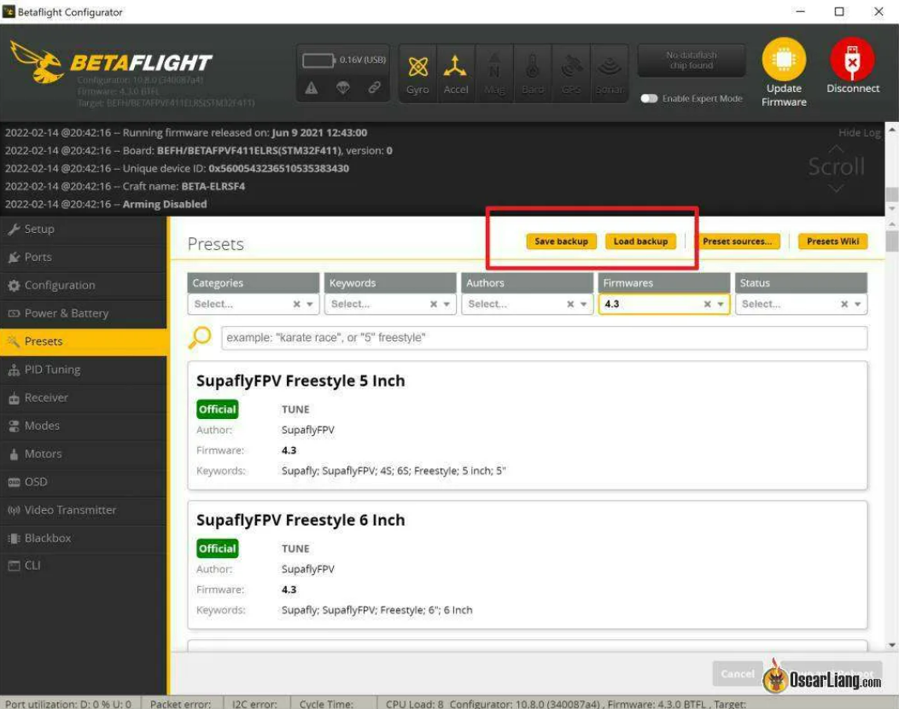
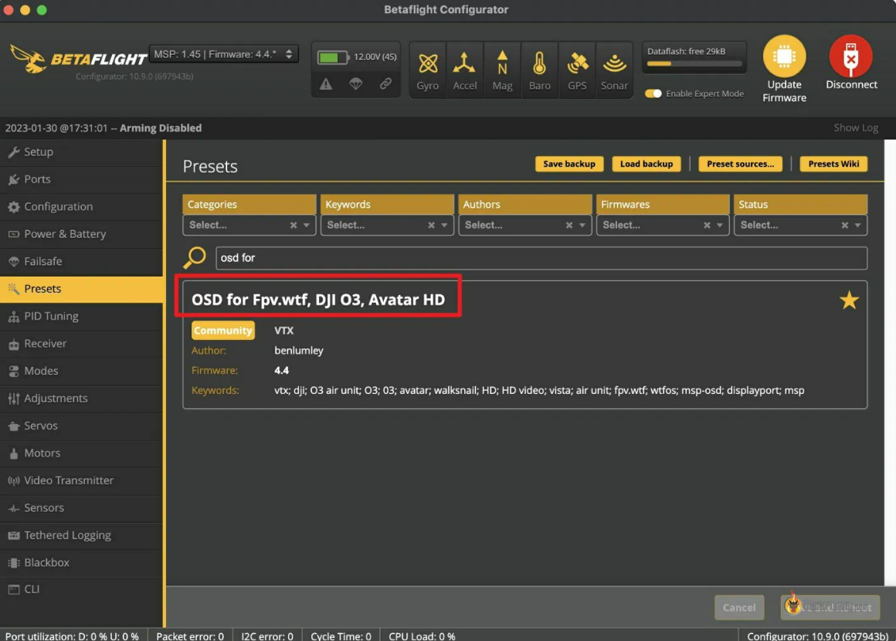
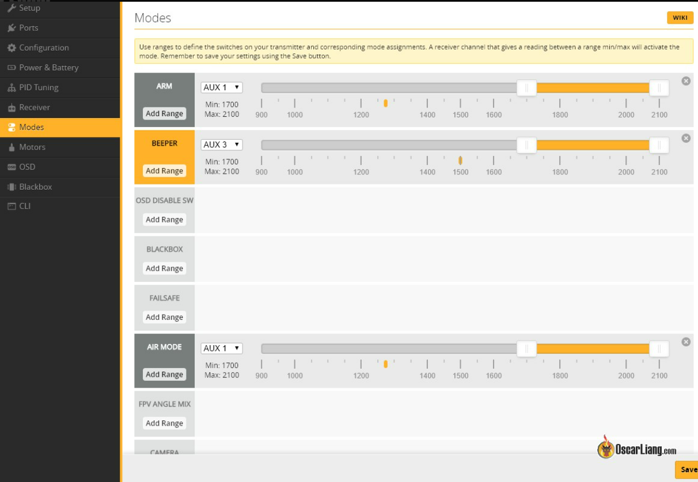

# How to Setup Betaflight Firmware

----------------------------------------------------------------------------------------------------------------
## 1.Install Betaflight Configurator

### Installation & Documentation
See: https://betaflight.com/docs/wiki

### Configuration Tool
To configure Betaflight you should use the Betaflight-configurator GUI tool (Windows/OSX/Linux) which can be found here:

https://github.com/betaflight/betaflight-configurator/releases/latest
----------------------------------------------------------------------------------------------------------------
## 2.Update Firmware

----------------------------------------------------------------------------------------------------------------
## 3.Configure Betaflight For The First Time
----------------------------------------------------------------------------------------------------------------
##   3.1.Connect FC to Computer
 

----------------------------------------------------------------------------------------------------------------
##   3.2.Setup

----------------------------------------------------------------------------------------------------------------
##   3.3.Presets

----------------------------------------------------------------------------------------------------------------
##   3.4.Voltage Calibration

----------------------------------------------------------------------------------------------------------------
##   3.5.Ports

----------------------------------------------------------------------------------------------------------------
##   3.6.Configuration

----------------------------------------------------------------------------------------------------------------
##   3.7.Receiver

----------------------------------------------------------------------------------------------------------------
##   3.8.Modes 

----------------------------------------------------------------------------------------------------------------
##   3.9.Motors

----------------------------------------------------------------------------------------------------------------
##   3.10.OSD

----------------------------------------------------------------------------------------------------------------
##   3.11.PID Tuning

----------------------------------------------------------------------------------------------------------------
##   3.12.Video Transmitter

----------------------------------------------------------------------------------------------------------------
##   3.13.Expert Mode

----------------------------------------------------------------------------------------------------------------
##   3.14.Stop Beeping on the Bench

----------------------------------------------------------------------------------------------------------------
##   3.15.Safety Checks Before Maiden Flight

----------------------------------------------------------------------------------------------------------------

