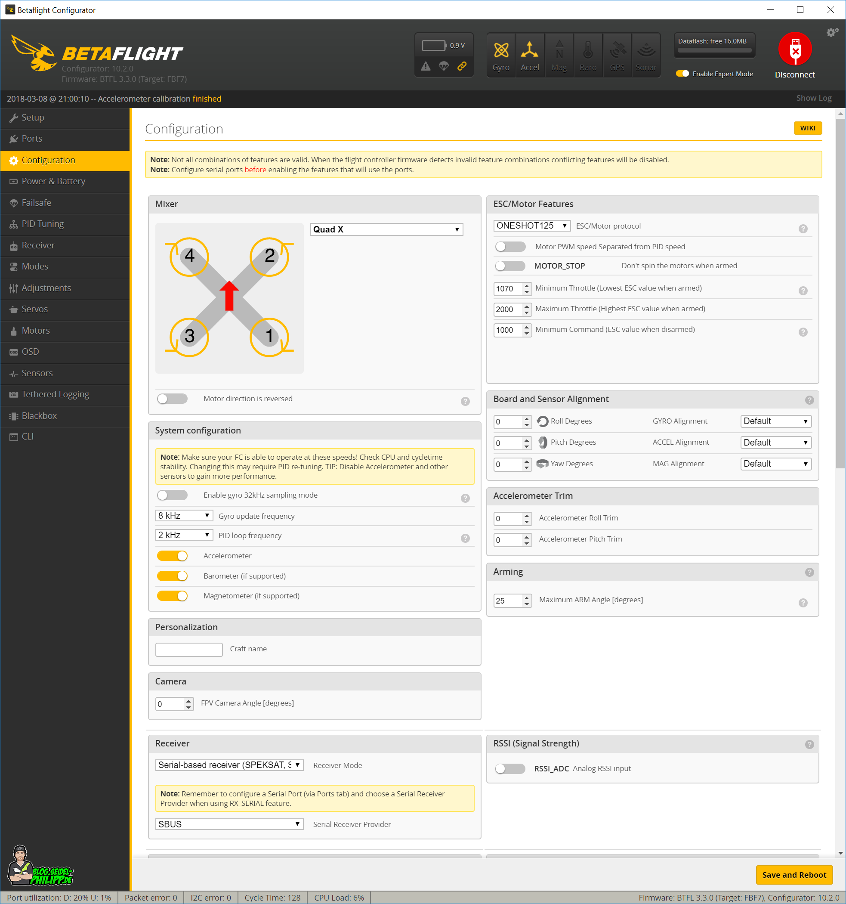

# How to Setup Betaflight Firmware

----------------------------------------------------------------------------------------------------------------
## 1.Install Betaflight Configurator

### Installation & Documentation
See: https://betaflight.com/docs/wiki

### Configuration Tool
To configure Betaflight you should use the Betaflight-configurator GUI tool (Windows/OSX/Linux) which can be found here:

https://github.com/betaflight/betaflight-configurator/releases/latest
---------------------------------------------------------------------------------------------------------------

## 2.Update Firmware

Flashing the FC consists of updating it so that it can have the latest software version from the constructor.

Before performing any manipulation on your fpv drone, you must save the original data of your drone. Indeed, if you have made a bad manipulation on the configuration, you just have to go back to this basic version of your configuration.

To perform the update, you must be in DFU (bootloader) mode. To do this, go to the “CLI” and tape : version, it will show us which target we should install. After that tape the command : diff,  by using this command, you can easily see the changes you have made to your drone's configuration and compare them to a previous working configuration. This can be useful for troubleshooting configuration issues or for optimizing your drone's performance.

the last step, is to be able to flash the firmware, you will have to restart in DFU mode (bootloader).
It is also possible to launch this mode by pressing the physical button of the FC and unplugging and replugging the USB cable.

Thereafter, => click “Flash Firmware” on Betaflight’s left navigation bar.

=> disable “Show release candidates” 
=> choose the model of your card.
=> select the latest available version of your FC.
Then it remains to click on “Load firmware [Online]”.

----------------------------------------------------------------------------------------------------------------
## 3.Configure Betaflight For The First Time
----------------------------------------------------------------------------------------------------------------
##   3.1.Connect FC to Computer
 

----------------------------------------------------------------------------------------------------------------
##   3.2.Setup

The “Setup” tab allows you to calibrate the accelerometer of your flight controller.

An accelerometer measures the linear acceleration of the drone on 3 axes (X/Y/Z). As a result, you will be able to know if your drone is moving on one of these three axes.

To calibrate your accelerometer, you must position your chassis flat, and click on the “calibrate” button. Make sure that it is of course a flat surface and that nothing moves during the calibration.

----------------------------------------------------------------------------------------------------------------
##   3.3.Port

At this stage, you have several options:

- Assign a receiver (Rx) to a UART: in the “Serial Rx” column, check the small button (it should turn yellow). If your receiver is on UART 4 (Tx 4 and Rx 4 on your FC), you need to go to the line of UART 4 (on Betablight).
- Declare a 4-in-1 ESC to a UART (individual ESCs do not need to be assigned): in the “Sensor Input” column, choose ESC.
- Assign a VTX to a UART.
- Declare a GPS to an UART (if you have one): always in the “Sensor input” column, choose GPS.

----------------------------------------------------------------------------------------------------------------

##   3.4.Configuration

In this part of Betaflight, you will be able to configure a major part of your multirotor (ESC etc…). For this, you have a multitude of fields to complete:
“System configuration” field:

“Gyro update frequency”: this value is blocked, no need to take care of it
“PID loop frequency”: leave the original value
Disable or enable the “barometer” if your HR has it
Disable “magnetometer”

“Other features” field:

TELEMETRY: activating telemetry will allow you to retrieve information from the sensors of your Flight Controller on the remote control
AIRMODE: the airmode must be activated since it allows your drone to keep the same trajectory when you let go of the controls. This prevents it from doing 360s when you let go of the controls.
OSD: this feature must be activated to have the information in your glasses or your FPV mask

“ESC/Motor Features” field:

“ESC/motor protocol”: This is the language used to communicate from the ESC to the FC. I invite you to see the ESC product sheet. OneShot and MultiShot protocols are older compared to Dshot protocol. If you have Dshot, I invite you to choose the Dshot300 or Dshot600. If you choose higher, you risk “burning” your ESC. In the situation where your ESCs do not have this protocol, fall back on OneShot125 or even Multishot

“Arming” field:

“Maximum angle to arm“: this value must be “180°”, this will allow you to take off your drone in the situation where it is stuck on a branch at 90 degrees from the ground.

----------------------------------------------------------------------------------------------------------------
##   3.5. Power & battery
Betaflight can report the current LiPo status to the pilot, and whether or not he can continue to fly. To do this, go to the “Power and battery” tab and configure:

The “Battery” field:

“Minimum voltage per cell”: 3.75 Volt per cell, once you have reached this battery level, you must land to preserve your battery.
“Maximum voltage per element”: 4.2 Volt per cell.
“Warning voltage per cell”: 3.70 Volt per cell. Going below this value can irreversibly damage your LiPo!

----------------------------------------------------------------------------------------------------------------
##   3.6.Voltage Calibration

----------------------------------------------------------------------------------------------------------------
##   3.7.Receiver

----------------------------------------------------------------------------------------------------------------
##   3.8.Modes 

I advise you to activate the following modes:

- PREARM: the prearm constitutes an additional security for arming (activating) the motors. In the situation where you accidentally cock your drone in your hands. It can save you from unnecessary injuries.
- ARM: arming your drone consists of activating the drone's motors
- HORIZON: for beginners, this mode allows the drone to be stabilized if necessary
- BEEPER: ring the buzzer (if you have one)
- GPS RESCUE: activate the GPS (if you have one)
To do this, you must choose an “AUX” and slide the rightmost or leftmost range selector.

----------------------------------------------------------------------------------------------------------------
##   3.9.Motors

You must test your motors one by one and you have to use the white slider to spin the motor and see if there is an error. Raise this value slightly (to 1050 or 1100), there is no point in raising it too high except overheating your components.

This is also an opportunity to check if the correct motor is running. For example, if you run motor 1, motor 1 is running and so on...

----------------------------------------------------------------------------------------------------------------
##   3.10.OSD

----------------------------------------------------------------------------------------------------------------
##   3.11.PID Tuning

----------------------------------------------------------------------------------------------------------------
##   3.12.Video Transmitter

----------------------------------------------------------------------------------------------------------------
##   3.13.Expert Mode

----------------------------------------------------------------------------------------------------------------
##   3.14.Stop Beeping on the Bench

----------------------------------------------------------------------------------------------------------------
##   3.15.Safety Checks Before Maiden Flight

----------------------------------------------------------------------------------------------------------------

